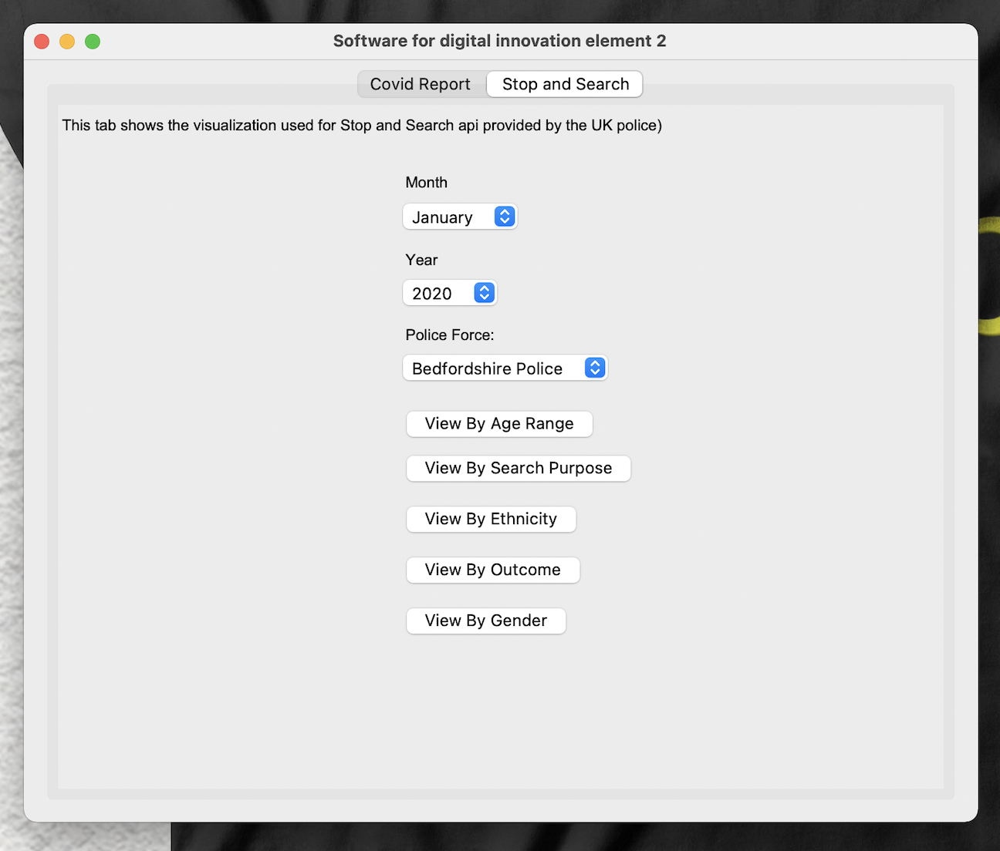
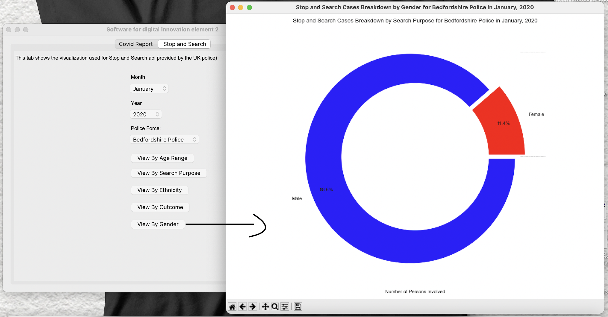

# Introduction

This project was done and submitted to the School of Computing, Engineering and Digital Technologies as part of the in course assessment(ICA) for Software for Digital Innovation by ***Chukwurah Paul Dumebi***. This GUI application was created with the help of the `Python Tkinter GUI framework` and additional helpful Python packages like pandas and numpy. The requirements.txt file contains a list of the full packages used in this project.

# Folder Structure

📦Paul
 ┣ 📂cache
 ┃ ┗ 📜store.py
 ┣ 📂charts
 ┃ ┗ 📜index.py
 ┣ 📂data
 ┃ ┗ 📜specimenDate_ageDemographic-unstacked.csv
 ┣ 📂img
 ┃ ┣ 📜.DS_Store
 ┃ ┣ 📜compare-two-regions.png
 ┃ ┣ 📜coverage.png
 ┃ ┣ 📜covid.png
 ┃ ┣ 📜daily-and-pct-change.png
 ┃ ┣ 📜stop-and-search-tab.png
 ┃ ┣ 📜test.png
 ┃ ┣ 📜tkinter-window.png
 ┃ ┣ 📜top-region-with-highest-cases.png
 ┃ ┣ 📜view-by-age-range.png
 ┃ ┣ 📜view-by-ethnicity.png
 ┃ ┣ 📜view-by-gender.png
 ┃ ┣ 📜view-by-month.png
 ┃ ┣ 📜view-by-outcome.png
 ┃ ┗ 📜view-by-search-purpose.png
 ┣ 📂modules
 ┃ ┣ 📂covid
 ┃ ┃ ┣ 📜covidFunc.py
 ┃ ┃ ┗ 📜index.py
 ┃ ┣ 📂stopSearch
 ┃ ┃ ┣ 📜index.py
 ┃ ┃ ┣ 📜requests.py
 ┃ ┃ ┗ 📜stopSearchFunc.py
 ┃ ┗ 📜.DS_Store
 ┣ 📂test
 ┃ ┗ 📜test_main.py
 ┣ 📂utils
 ┃ ┣ 📜filterParams.py
 ┃ ┣ 📜monthList.py
 ┃ ┣ 📜validateForm.py
 ┃ ┗ 📜widgets.py
 ┣ 📜.DS_Store
 ┣ 📜.coverage
 ┣ 📜README.md
 ┣ 📜main.py
 ┣ 📜requirements.txt
 ┗ 📜test_main.py

# Installation

This project was developed using a number of `Python packages`, all of which must be installed before the project can be used. The versions of the packages must match the ones used during the project's development because using a different version may result in unexpected behaviours. It is important to note that for this project to run smoothly, ***Python version 3 upwards*** is highly recommended.

`Steps`

1. ***Python*** :
    Visit the python official website to install python (`https://www.python.org/downloads/`). Download a python interpreter compatible with your device. For ***Mac*** the in built one is not recommended update to ***Python 3***

2. ***Packages*** :
    To install the packages used and their respective version which is located in the requirements.txt file. Open the project folder in ***Command Prompt*** or ***Terminal (Mac)*** and type the following command `python -m pip install -r requirements.txt`. For ***Mac Users*** use `python3 -m pip install -r requirements.txt`.

This will successfully install all python packages used in this project.

# Launch

To launch the application, open the project folder in ***Command Prompt*** or ***Terminal (Mac)*** and type or paste this command `python -m main`. For ***Mac*** use `python3 -m main`, this will start the GUI application .

# Available Visualisations

This GUI driven application helps users to process and visualize the following:

1. Covid-19 cases information from 03/2020 to 11/2020 - 

    1. Daily and %Change in daily cases .
    2. Compare two regions .
    3. Top region with highest cases .
    4. View cases by month .

2. Stop and Search information from 01/2020 to 12/2022 - 

    1. View by age range 
    2. View by search purpose 
    3. View by ethnicity 
    4. View by outcome 
    5. View by gender 

# How to run test

NB: ***All of the aforementioned packages must be installed before attempting to run tests for the application***.
In this project, the `Testing Driven Development (TDD)` approach was used. All tests are contained in the  ***test_main.py*** file.

The procedures shown below show how to execute the tests used for this project and evaluate the application's test coverage:

1. Run ***test_main.py*** file. Open the project folder in ***Command Prompt*** or ***Terminal (Mac)*** and type `python -m test_main`. For ***Mac*** type `python3 -m test_main`, this runs all the test present in the file with the result of each test pass or fail see image .

2. To check for test coverage, Open the project folder in ***Command Prompt*** or ***Terminal (Mac)***
    1.Run the tests with coverage first by entering the following command into ***Command Prompt*** or ***Terminal (Mac)***. `python -m coverage run -m unittest discover`. For ***Mac*** use `python3 -m coverage run -m unittest discover`, this runs all the test for the GUI application and calculates the coverage .
    
    2. To report the coverage in ***Command Prompt*** or ***Terminal (Mac)*** enter the following command `python -m coverage report -m`. For ***Mac*** use `python3 -m coverage report -m`, this shows the coverage of the tests see image .

The report contains the full details about the Blackbox testing, both functional and non-functional. Thanks 🙏
